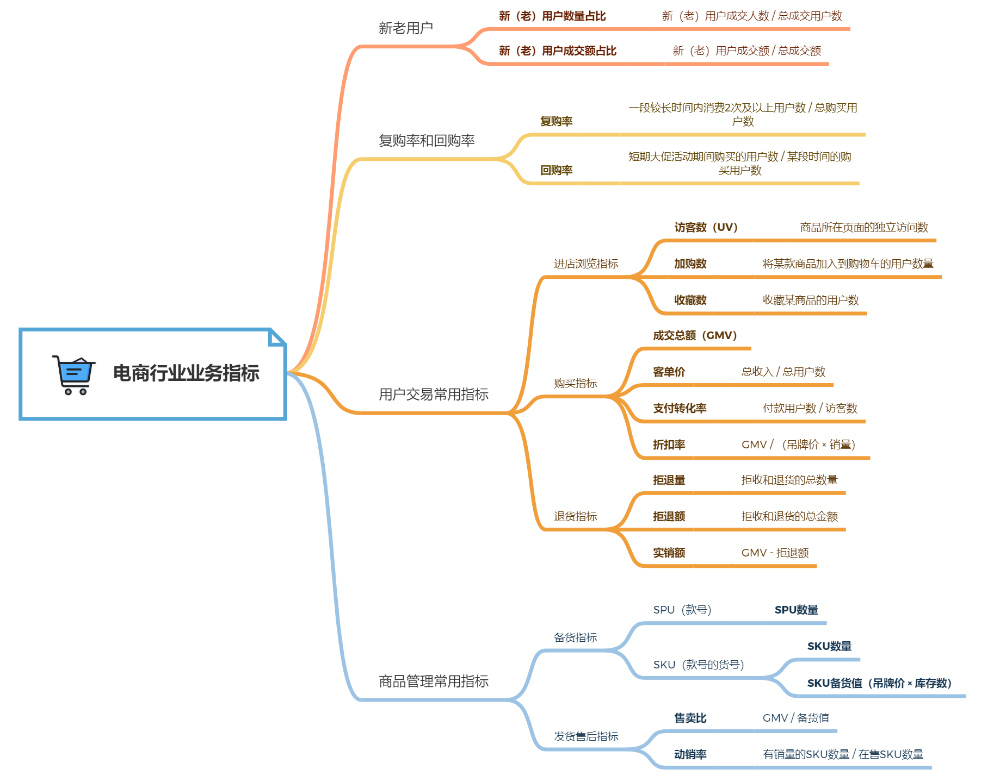

# 第4章 国内电商行业

从本章开始，会介绍大部分行业的业务知识，以及对应的案例分析。

## 4.1 业务知识

### 4.1.1 4种业务模式

- 企业卖家——企业买家（Business to Business，B2B）
- 企业卖家——个人买家（Business to Consumer，B2C）
- 个人卖家——个人买家（Consumer to Consumer，C2C）
- 卖家线上售卖-买家线下门店提货/换货（Online to Offline，O2O）

### 4.1.2 服务商与企业买家的关系

随着电商不断发展，一种新型角色应用而生——服务商。服务商主要是通过帮助企业运营店铺收取服务费盈利，比如：店铺装修、设计、客服、仓储等服务。

### 4.1.3 业务指标

## 4.2 案例分析

### 4.2.1 案例陈述

2019年“双11”结束后，某店KPI未达成。经过初步分析，11月11日首次交易的新用户数量可观，KPI缺口可能与已购用户销售表现不佳有关。现在需要找出问题的原因，并给出改进建议。

### 4.2.2 分析思路

**明确问题**

- 确认分析对象：为已购用户

- 确认分析时间范围：2019年“双11”与历年“双11”

- 确认指标：“双11”是短周期大促，采用回购率指标

- 确认目标：分析回购率下降原因，提出建议

