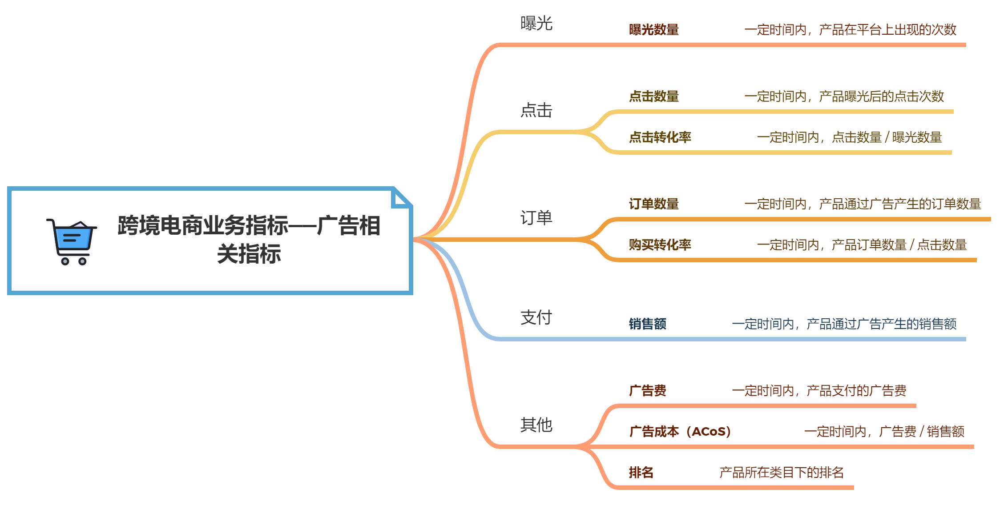

# 第5章 跨境电商行业

## 5.1 业务知识

### 5.1.1 跨境电商

跨境电商是指通过跨境物流送达商品、完成交易的一种国际商业活动。跨境电商的经营流程如下：

- 境内买家向跨境电商下单
- 境外卖家通过跨境电商接单
- 境外卖家将货物出库
- 货物通过国际物流运输到海关
- 海关转交给境内物流
- 境内物流将货运输给境内买家

从卖家的角度看，买家的购物流程分为：

- 用户下单
- 卖家打单：卖家收到订单后在后台制作订单
- 仓库出库
- 快读运输
- 买家签收

### 5.1.2 3种业务模式

- 平台型：卖家入驻跨境电商平台来进行运营
- 自营型：跨境电商平台自己运营
- 混合型：跨境电商平台兼有平台型和混合型

## 5.2 业务指标

