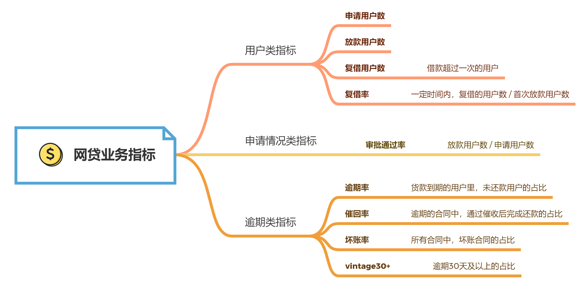

# 第6章 金融信贷行业

## 6.1 业务知识

### 6.1.1 金融机构

金融机构是指从事金融行业的公司，主要包括：

- 银行：负责存款、贷款、信用卡、代销保险、理财等业务
- 证券公司：帮助用户买卖股票及其衍生品，帮助企业上市发行股票及债券或自营股票及其衍生品等
- 保险公司：负责重疾险、寿险、财险、养老保险等业务
- 信托公司：负责资金信托、动产信托、不动产信托、有价证券信托等业务
- 网贷公司：通过搭建网络贷款平台，为借款人和贷款人提供资金服务
- 第三方支付公司：为交易双方提供资金交易通道，解析交易新人问题
- 金融科技公司：用技术给银行、政府部门和企业提供数据仓库、风控系统、智能营销类的数字化服务

### 6.1.2 金融行业分类 

本章主要以金融信贷行业的线上模式为主，后文统称为“网贷”。

### 6.1.3 网贷的业务模式

网贷最终的三部分是资金（钱从哪里来）、风控（风险控制）和获取用户（用户从哪里来）。具体业务流程如下：

- 获取用户：**运营部门**负责想方设法获取更多的用户来申请贷款
- 提交审核：**风控部门**负责对贷款申请进行风险审核，把高风险用户挡在门外
- 过审签约：**法务部门**负责降低法律、政策方面的风险
- 放款：**财务部门**负责向用户放款、核对用户的还款情况
- 还款：贷款到期后，若用户能够按时还款，由财务部门确认收到还款；若用户不能按时还款，则由风控部门下属的**贷后管理部门**进行催收，或者由**法务部门**向法院提出仲裁申请或起诉用户

一句话总结网贷的业务逻辑：依靠风控技术准确地找到目标用户，将风险控制在低水平，在合规地利率下实现盈利。由此可以看出，风控是网贷业务最核心的环节。

### 6.1.4 风控策略的业务模式

风控策略是一些用来判断用户是否满足放款条件的规则。一般来说，每个产品都会有若干条这样的策略。常见的风控策略业务模式有：

- 纯人工审批
- 自动化审批 + 人工审批
- 纯线上风控

【推荐阅读】[剖析主流的三种风控模式](https://zhuanlan.zhihu.com/p/428705081)

## 6.2 业务指标

