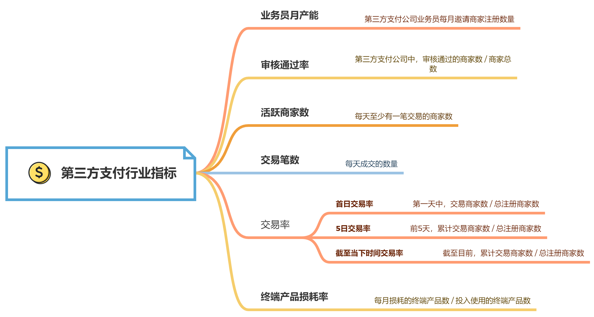

# 第7章 金融第三方支付行业

第三方支付是指具备一定实力和信誉保障的公司，通过与银联或网联（非银行支付机构的网络支付清算平台）对接而促成交易双方进行交易的网络支付模式。

第三方行业分类：

- 互联网支付行业：以在线支付为主，捆绑各大电商平台
- 金融支付公司：侧重行业需求和开拓行业应用
- 第三方支付公司：提供线下终端产品

本章主要讨论第三方支付公司。

## 7.1 业务知识

### 7.1.1 第三方支付公司业务流程

第三方支付公司为线下商家提供收费终端产品，帮助商家进行收款，然后从中获取手续费。终端产品包括扫码枪、付款码等。

从**用户**的角度出发，第三方支付公司业务流程如下：

1. 用户购买产品，通过终端产品付款给商家
2. 付款金额全额流向第三方公司
3. 第三方公司从中收取一定的手续费，并将剩余结算金额返还给商家

从**商家**的角度出发，第三方支付公司业务流程如下：

1. 第三方公司线下推广，说服商家购买终端产品，并与商家签订合同；商家注册，绑定银行卡、上传相关资料
2. 提交完资料后，由第三方公司风控部门审核。主要审核商家的营业执照等资料是否齐全，资料不全的话，需要重新提交
3. 审核通过后，商家可以用终端产品进行收款
4. 公司会设置相关的考核指标（例如交易额需要达到多少）来查看商家交易情况，并进行数据化管理,为商家提供交易分析报告
5. 商家通过终端产品绑定的数据平台来查看分析报告，了解营收情况

## 7.2 业务指标

业务指标是指第三方支付公司使用终端产品获得的商家以及交易数据，通过这些指标可以衡量第三方支付公司的业务。

