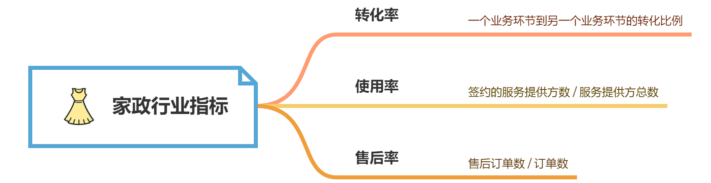

# 第8章 家政行业

## 8.1 业务知识

### 8.1.1 家政

家政是指帮忙处理家庭事务的服务，常见的家政角色分为育儿嫂、月嫂、保姆。

- 育儿嫂：提供照看新生儿相关的服务，但一般不提供新生儿出生后第一个月的服务。一般需要得到官方认证的育婴师证
- 月嫂：同时照顾产妇和新生儿，服务期一般为产褥期，即月子期
- 保姆：提供洗衣服、打扫卫生等专业性不强的服务

### 8.1.2 家政平台

家政平台是一个帮助家政服务人员（服务提供方）寻找用户（服务需求方），同时帮助用户寻找家政服务人员的平台。

### 8.1.3 业务模式

服务提供方的业务模式：

- 线索：寻找一切有关保姆、育儿嫂、月嫂等家政服务人员的信息，他们的电话号码就是一条线索
- 商机：招商人员根据线索打电话一一确认是否有从事家政工作的意向
- 邀约：招商人员对确认有意向从事家政工作的人发出面试邀请。下面的环节由运营人员负责
- 到店：运营人员接待到店参加面试的候选人员。运营人员对候选人员的来源渠道进行分类，并检查相关资料，然后根据实际情况安排面试
- 面试：能够参加面试的，由运营人员安排面试。面试分为自培和非自培
  - 自培：无相关证书，需要公司先进行培训，之后再取得国家证书。自培主要考察个人素质是否适合家政工作
  - 非自培：已取得国家证书的不需要公司培训。非自培主要考察其相关技能是否合格
- 面试通过：自培人员面试通过后，公司会统一组织为期一个月左右的家政培训，培训考试通过后办法相关证书；非自培人员直接参加接下来的星际认证
- 星级认证：星际用于确定服务提供方的服务水平，与工资挂钩。自培人员在培训通过后，一般自动认定为1星或初级，具体看公司规定；非自培人员根据自身实际水平定级
- 签约：认证完成后，公司与该人员签订条约以及相关的服务条款，然后将人员的资料加入家政平台

服务需求方的业务模式大致和服务提供方类似：

- 服务提供方寻找需要家政服务的用户线索
- 用户对服务提供方面试
- 面试通过后，用户和公司签订服务合同

## 8.2 业务指标

